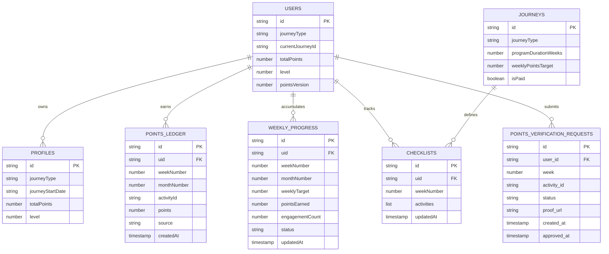

# Architecture, Rules, and Ownership Lock

## Purpose
This document locks the canonical data model, journey math, approval workflow, and rollout strategy for the points + journey system. It is intended to remove ambiguity before any new code ships.

## Canonical Data Model (Ledger-First)
### Source of Truth
* **`pointsLedger` is the system of record** for points. Each ledger entry is immutable once awarded and is the authoritative source for totals, weekly progress, and window rollups.
* Aggregations (weekly status, totals, levels) are **derived from ledger entries** and can be rebuilt from ledger data.
* Legacy collections (`weekly_points`, `user_points`) are read-only during migration and will be deprecated after parity.

### Entity Relationship Diagram (Mermaid)

### Ledger-First Invariants
1. **Awarding points writes to `pointsLedger` first** and uses transactions to update `weeklyProgress` and user/profile totals as derived fields.
2. **Revoking points deletes ledger entries** and recomputes derived totals and weekly status.
3. **Weekly progress is not authoritative**; it can be recalculated from `pointsLedger` if a discrepancy is detected.
4. **Approval workflows never write totals directly**; they only trigger ledger writes.

## Journey Math (Windows, Targets, Pass Marks)
### Window Math (Canonical)
* **Window size**: 4 weeks.
* **Window number**: `ceil(weekNumber / 4)`.
* **Window week**: `((weekNumber - 1) % 4) + 1`.
* **Window target**: `weeklyTarget * windowWeeks` where `windowWeeks` is 1–4 depending on partial windows.

### Weekly Pass Marks (Canonical)
* **On Track**: `pointsEarned / weeklyTarget >= 1.0`.
* **Recovery**: first time reaching `>= 1.0` after being in alert.
* **Warning**: `0.75 <= pointsEarned / weeklyTarget < 1.0`.
* **Alert**: `< 0.75`.

> Legacy `weekly_points` uses 70% / 40% thresholds and is considered deprecated. All new reporting uses the canonical thresholds above.

### Journey Reference Table
| Journey | Total Weeks | Weekly Target | Windows | Window Ranges (Weeks) | Target per Window |
| --- | --- | --- | --- | --- | --- |
| 4W | 4 | 2,500 | 1 | 1–4 | 10,000 |
| 6W | 6 | 4,000 | 2 | 1–4, 5–6 | 16,000; 8,000 |
| 3M | 12 | 4,000 | 3 | 1–4, 5–8, 9–12 | 16,000 each |
| 6M | 24 | 4,000 | 6 | 1–4, 5–8, 9–12, 13–16, 17–20, 21–24 | 16,000 each |
| 9M | 36 | 4,000 | 9 | 1–4, 5–8, 9–12, 13–16, 17–20, 21–24, 25–28, 29–32, 33–36 | 16,000 each |

## Approval Workflow Matrix
| Activity Type | Verification Mode | Who Submits | Who Approves | Collection Written | Ledger Write Trigger |
| --- | --- | --- | --- | --- | --- |
| Honor-based activity | `honor` | Learner | Auto | `pointsLedger`, `weeklyProgress` | Immediate award on completion |
| Partner-verified activity | `partner_approval` | Learner (with proof) | Partner/Admin | `points_verification_requests` | Award on approval event |
| Manual/legacy activity | `partner_approval` (fallback) | Learner/Admin | Partner/Admin | `points_verification_requests` | Award on approval event |

### Approval States (Canonical)
* **Pending** → awaiting partner/admin decision.
* **Approved** → points awarded to ledger, weekly status updated.
* **Rejected** → no ledger write; checklist item returns to `not_started`.

## Rollout Strategy (Parallel → Migrate → Deprecate)
### Phase 1 — Parallel Run
* **Dual-write**: continue existing writes to legacy collections while writing to `pointsLedger` and `weeklyProgress`.
* **Read-path parity**: dashboards show both legacy and ledger-derived totals for comparison.
* **Alerting**: nightly diff jobs flag mismatches between legacy totals and ledger-derived totals.

### Phase 2 — Migrate
* **Backfill ledger** from legacy data (`weekly_points`, `user_points`) for all active users.
* **Recalculate** weekly progress and totals from ledger post-backfill.
* **Lock**: cut over all read paths to ledger-derived views once parity holds for two consecutive windows.

### Phase 3 — Deprecate
* **Freeze** legacy collections to read-only.
* **Archive** legacy collections after 90-day clean window.
* **Remove** legacy UI and service dependencies.

### Rollback Strategy
* **Switch reads back** to legacy collections using feature flags.
* **Pause ledger writes** if a systemic issue is detected.
* **Re-run backfill** from the last known-good legacy snapshot.

## Ownership & Sign-Off
| Area | Primary Owner | Required Sign-Off |
| --- | --- | --- |
| Canonical data model | Engineering | Product + Data | 
| Journey math & targets | Product | Engineering + Partner Ops |
| Approval workflow | Partner Ops | Engineering + Product |
| Migration & rollback | Engineering | Product + Partner Ops |

## Acceptance Criteria
* No unresolved ambiguity in rules or targets.
* Engineering and Product sign-off recorded on this document.
* Migration risks documented and accepted by stakeholders.
